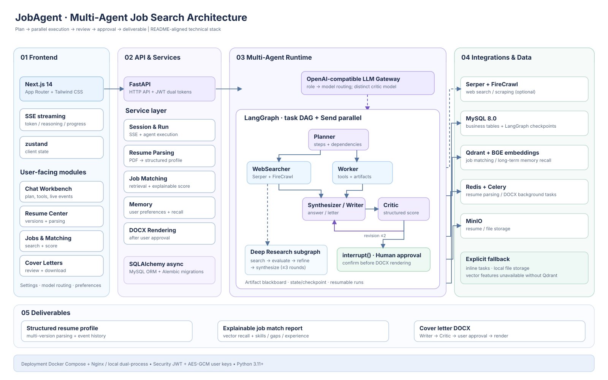
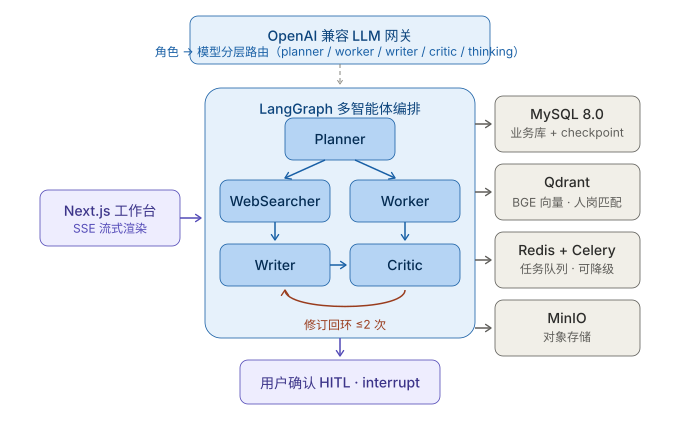
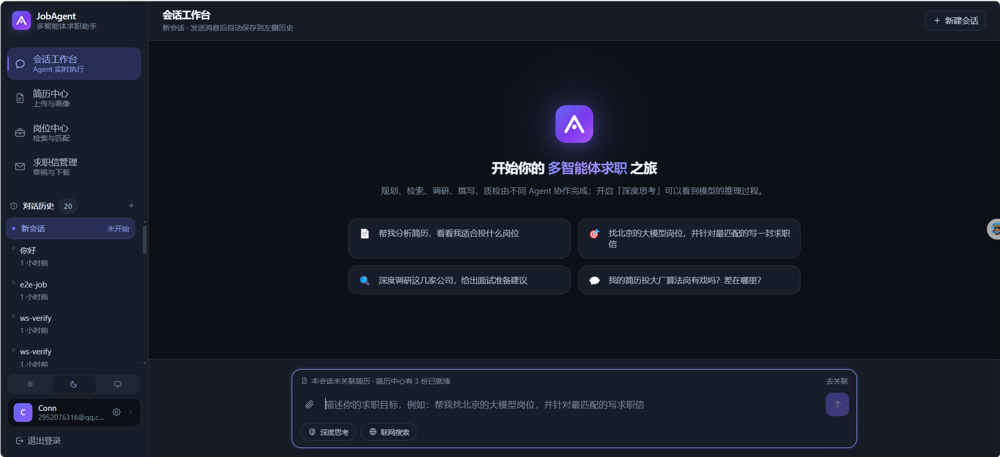

<div align="center">

# 🤖 JobAgent · 多智能体求职助手

**把多步骤、需要质量闭环的求职流程，交给一组分工明确的 AI Agent 协作完成**

<p>
<a href="https://www.python.org/"></a> <a href="https://fastapi.tiangolo.com/"></a> <a href="https://langchain-ai.github.io/langgraph/"></a> <a href="https://nextjs.org/"></a> <a href="https://tailwindcss.com/"></a> <a href="https://www.mysql.com/"></a> <a href="https://redis.io/"></a> <a href="https://qdrant.tech/"></a> <a href="https://www.docker.com/"></a> <a href="#-测试与验证"></a> <a href="./LICENSE"></a>
</p>

</div>

<p align="center"><sub>会话工作台：执行计划实时进度、工具调用轨迹、会话级参考简历，以及「深度思考 / 联网搜索」两个开关</sub></p>

---

## 🏗️ 系统架构



自左向右分为四层 + 产出：

- **01 Frontend** —— Next.js 14（App Router + Tailwind）、SSE 流式事件（token / reasoning / progress）、zustand 客户端状态；
  承载会话工作台、简历中心、岗位匹配、求职信、设置。
- **02 API & Services** —— FastAPI（HTTP API + JWT 双 Token）、SQLAlchemy async（MySQL ORM + Alembic）；
  服务层含会话与 Run、简历解析、人岗匹配、记忆、docx 渲染。
- **03 Multi-Agent Runtime** —— OpenAI 兼容 LLM 网关（角色 → 模型分层路由，Critic 用不同模型）
  + LangGraph（任务 DAG + `Send` 并行）：Planner → WebSearcher / Worker → Synthesizer·Writer → Critic（修订 ≤2 次）
  → `interrupt()` 人工确认；状态经 artifact 黑板 + checkpoint 持久化，可断点续跑。
- **04 Integrations & Data** —— MySQL 8.0（业务表 + checkpoint）、Qdrant + BGE 向量、Redis + Celery、MinIO；
  缺失时显式降级（inline 任务 / 本地文件存储 / 向量功能不可用）。
- **05 Deliverables** —— 结构化简历画像、可解释的人岗匹配报告、求职信 DOCX。

Agent 内部协作链路（放大看编排细节）：



---

## 🎯 为什么做这个项目

求职不是一次性问答，而是一条长链路：

> 📄 读懂简历 → 💭 理解诉求 → 🔍 搜索岗位 → 📊 评估匹配 → ✍️ 打磨表达 → 📮 生成可投递的求职信

单一 LLM 对话在这条链路上有三个硬伤：

1. **任务混杂** 🌀 —— 规划、检索、写作、评审挤在一个上下文里，互相干扰，质量不可控；
2. **开环生成** 🎲 —— 写完即交付，没有人检查，错了也没人兜底；
3. **状态易失** 💧 —— 长任务中途断了就得重来，中间产物（搜到的岗位、匹配结果）随手丢弃。

**JobAgent 的设计初衷**：用多智能体编排正面解决这三个问题 —— 让专业 Agent 各管一段，
用结构化计划驱动执行，用评审闭环保证质量，用持久化状态支撑长任务断点续跑。

## 🧭 设计目标

| | 目标 | 说明 |
|---|------|------|
| 🗺️ | **规划先行** | Planner 把用户诉求拆解成任务 DAG（`Plan.steps` + `depends_on`），执行过程对用户完全可视化 —— 每一步 done / running / pending 实时可见 |
| 🧠 | **黑板协作** | Agent 之间不扫消息历史、不靠关键词路由，各自只读写自己的字段，直接消费上游产出的 artifact |
| ⚡ | **并行执行** | 无依赖的步骤通过 LangGraph `Send` 并行超步同时执行 |
| 🔁 | **质量闭环** | Critic 用与生成器**不同的模型**做结构化评分，不达标则触发修订（≤2 次） |
| 🙋 | **人在回路** | 生成求职信 docx 这类不可逆动作，必须经用户 `interrupt()` 确认后才落盘 |
| 💾 | **断点续跑** | 会话状态由 MySQL checkpointer 持久化，中途失败可从断点恢复 |
| 📚 | **资产沉淀** | 岗位落库去重、匹配结果可解释、简历与偏好沉淀为长期记忆，越用越懂你 |
| 🛡️ | **诚实降级** | 外部依赖（向量库 / Redis / 搜索 Key）缺失时明确告知并降级，绝不静默失败，也绝不假装开关有效 |

## 🧱 技术栈

| 层 | 选型 |
|----|------|
| 🖥️ **前端** | Next.js 14（App Router）+ Tailwind CSS，SSE 流式渲染，zustand 状态管理 |
| ⚙️ **后端** | FastAPI + SQLAlchemy（async），Alembic 迁移 |
| 🕸️ **Agent 编排** | LangGraph（任务 DAG / Send 并行 / interrupt HITL / checkpointer 持久化） |
| 🧩 **LLM 接入** | OpenAI 兼容协议统一接入，角色 → 模型分层路由（planner / worker / writer / critic / synthesizer / thinking） |
| 🗄️ **数据库** | MySQL 8.0（业务库 + LangGraph checkpoint） |
| 🔎 **向量检索** | Qdrant + BGE 系 Embedding（人岗匹配召回、长期记忆召回） |
| 📬 **任务队列** | Celery + Redis（简历解析 / docx 渲染；不可用时自动进程内降级） |
| 📦 **对象存储** | MinIO（默认降级为本地存储 `backend/.storage`） |
| 🌐 **联网能力** | Serper（Google 搜索）/ FireCrawl（页面抓取），用户级密钥 AES-GCM 加密存储 |
| 🔐 **鉴权** | JWT 双 Token |
| 🐳 **部署** | Docker Compose（基础设施 / 全栈含 Nginx），或纯本地双进程运行 |

## 🚀 快速开始（本地，无需 Docker）

### 🪟 Windows / PowerShell（一键）

先做一次解除执行策略（当前用户永久生效）：

```powershell
Set-ExecutionPolicy -Scope CurrentUser RemoteSigned
```

之后：

```powershell
.\scripts\start-local.ps1                     # ▶️ 后端 + 前端（next dev，带 HMR）
.\scripts\start-local.ps1 backend             # ▶️ 只启后端
.\scripts\start-local.ps1 frontend            # ▶️ 只启前端
.\scripts\start-local.ps1 frontend -Prod      # ▶️ 只启前端，走生产构建
.\scripts\stop-local.ps1                      # ⏹️ 停止全部
```

服务以独立进程运行，关闭终端不会停止；日志在 `logs/backend.log`、`logs/frontend.log`。

### 📋 前置准备

外部服务只有 **MySQL 8.0 是必需的**（业务库 + checkpoint）。
Redis / Qdrant / MinIO **可选**，缺失时自动降级，不影响核心对话：

| 服务 | 缺失时的表现 |
|------|-------------|
| ⚪ Redis | 简历解析 / docx 渲染降级为进程内执行（功能可用，不跨进程排队） |
| ⚪ Qdrant | 人岗匹配与长期记忆向量召回不可用，其余功能不受影响 |
| ⚪ MinIO | 文件落本地 `backend/.storage` |

```bash
# 0) 建库（仅一次，必须 utf8mb4_0900_ai_ci）
mysql -u root -p -e "CREATE DATABASE IF NOT EXISTS jobagent CHARACTER SET utf8mb4 COLLATE utf8mb4_0900_ai_ci;"

# 1) 后端依赖
cd backend
cp .env.example .env               # LLM Key 可留空，之后在前端「设置」里填
pip install -e .

# 2) 数据库迁移
python -m alembic.config upgrade head
```

> 💡 大模型 Key 在「设置 → 大模型接入」页填写，支持按角色分层路由到不同模型 / 服务商。
> 没配 Key 时简历能上传但解析会失败，填好后到「简历中心」点「重新解析」即可，无需重传。

启动后访问：

- 🖥️ 前端工作台：http://localhost:3000
- 📖 接口文档：http://127.0.0.1:8000/api/docs

### 🐳 Docker（可选，一键全栈）

```bash
docker compose -f docker/docker-compose.dev.yml up -d   # 仅基础设施
docker compose -f docker/docker-compose.yml up --build  # 全栈含 Nginx
```

## ✨ 系统能力一览

### 💬 会话工作台（核心界面）

- 🗺️ Planner 生成执行计划并可视化（进度条 + 每步状态）；右侧栏展示工具调用轨迹。
- ⚡ 真流式输出：逐 token 渲染；首个 token 到达前显示「模型正在思考 + 已等待秒数」。
- 🧠 **深度思考**：切换 thinking 角色模型（如 deepseek-reasoner），`reasoning_content`
  以独立事件下发，渲染为可折叠的思考面板。
- 🌐 **联网搜索**：Planner 强制插入 WebSearcher 步骤；未配 Serper Key 时明确提示而非静默无效。
- ⏹️ 可中止（AbortController）、可复制、可对最后一条回答「重新生成」。
- 📎 会话级参考简历：上传 PDF 即作为本会话上下文，严格绑定到会话，不串数据。

### 📄 简历中心

- 🗂️ 多版本管理（版本号递增）、重新解析、操作时间线（上传 / 解析开始 / 成功 / 失败全程可回放）。
- 🗑️ 删除两步确认：先删对象存储再删库，会话与求职信仅断开引用、不误删。
- 🔒 归属校验：他人的简历返回 404，不暴露资源存在性。

### 📊 人岗匹配

- 岗位先落库去重，再做向量召回 + 结构化评分（技能覆盖 / 差距 / 经验年限），
  输出**可解释**的匹配报告而非 "LLM 看着猜"。

### ✉️ 求职信

- 🖋️ Writer 生成 → 🔍 Critic 评分 → 🔁 不达标自动修订 → 🙋 用户确认 → 📄 渲染 docx。

### ⚙️ 统一设置页

- 👤 账号信息 / 🎨 外观（白天 · 夜晚 · 跟随系统）/ 🔌 大模型接入（分层路由 + 测试连接）/ 🎯 求职偏好。
- 🌗 深色模式通过 CSS 变量整套翻转（`surface.* / ink.* / tint.*` 设计令牌），首帧无闪烁。

## 🗂️ 工程结构

```
backend/app/
├── api/v1/routers/     auth session resume job letter run me（校验 / 鉴权 / 响应组装）
├── core/               config db security logging errors sse storage cache injection_guard
├── models/             SQLAlchemy ORM（users / resumes / sessions / messages / agent_runs /
│                       job_postings / match_results / cover_letters / user_memories 等）
├── repositories/       数据访问封装
├── services/           auth session resume job letter memory orchestrator
├── agents/
│   ├── graph/          planner executor workers synthesizer critic hitl finish builder state
│   ├── subgraphs/      deep_research（搜索→评估→补搜→综合，≤3 轮，强制引用来源）
│   ├── tools/          web_search / scraper / job_search / resume_extractor / render_docx
│   ├── prompts/        按 Agent 拆分的提示词
│   ├── memory/         user_memories + Qdrant 向量召回
│   └── llm/            model_router（角色→模型分层路由）
├── matching/           embedding retriever scorer（可解释匹配评分）
└── workers/            celery_app + dispatch（TCP 预检 + inline 降级）+ tasks

frontend/
├── app/
│   ├── (dashboard)/    会话工作台 / 简历中心 / 岗位 / 求职信 / 设置
│   └── globals.css     设计令牌（:root / .dark 两套 CSS 变量）
├── components/         内联 SVG 图标集 / 思考面板 / 计划视图 / 确认卡片
└── lib/                api（统一超时 + envelope）/ sse / store / theme / format / auth
```

## 🧪 测试与验证

```bash
cd backend && pytest -q    # ✅ 单测不依赖 MySQL / Redis / MinIO（SQLite + 本地存储）
```

| 测试 | 覆盖 |
|------|------|
| 🧩 `test_dispatch.py` | 任务分发：broker 不可达必须快速返回、绝不调 `delay()`、降级任务真的执行 |
| 📄 `test_resume_lifecycle.py` | 简历删除 / 清空 / 上传校验 / 派发竞态 |
| 🔐 `test_security.py` · 🗺️ `test_planner.py` · 📊 `test_scorer.py` · 🕸️ `test_graph_compile.py` | 加密、Planner 解析、匹配打分、图编译 |

端到端自检（真起服务、真连 MySQL）：

```bash
cd backend && PYTHONIOENCODING=utf-8 python -X utf8 scripts/verify_resume_lifecycle.py
```

